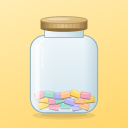
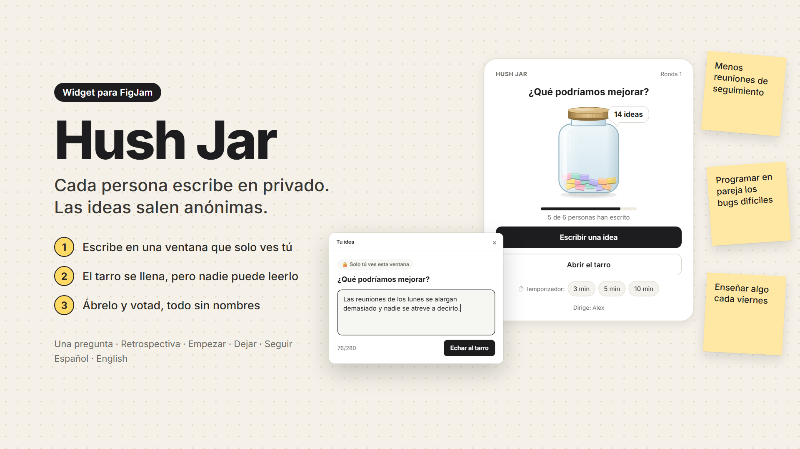
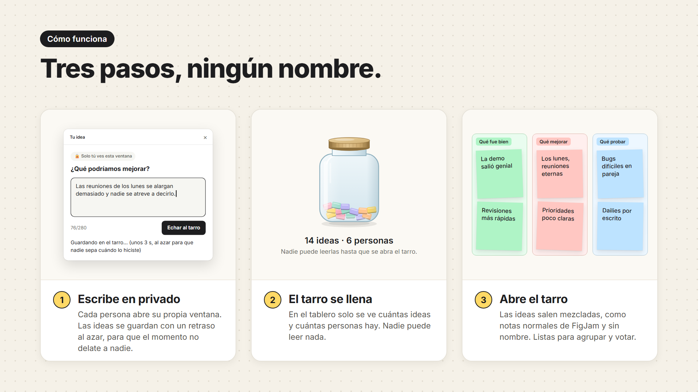

<p align="center">
  
</p>

<h1 align="center">Hush Jar</h1>

<p align="center">
  <b>Cada persona escribe en privado. Las ideas salen anónimas.</b><br>
  Un widget de FigJam para retros, lluvias de ideas y esas preguntas que la gente responde con más sinceridad cuando nadie sabe quién dijo qué.
</p>

<p align="center">
  
  
  
  
</p>

<p align="center"><a href="README.md">English</a> · <b>Español</b></p>

<p align="center">
  
</p>

## Por qué

En FigJam cada nota lleva el nombre de quien la escribe, y cualquiera puede volver a mostrarlo. Además, en cuanto alguien escribe, el resto lo lee, y la primera idea del tablero marca el tono de las demás. Miro y Mural tienen un modo privado para esto. FigJam no, y en el foro de Figma se lleva pidiendo [escritura privada](https://forum.figma.com/suggest-a-feature-11/private-writing-13312) y [notas de verdad anónimas](https://forum.figma.com/suggest-a-feature-11/bring-truly-anonymous-sticky-notes-to-figjam-8801) desde 2022.

Lo habitual es tirar de Google Forms o Slido y luego pegar las respuestas en el tablero. Hush Jar lo hace dentro del propio tablero. Solo quien dirige pone el widget; el resto solo tiene que hacer clic.

## Cómo funciona

<p align="center">
  
</p>

1. **Prepara.** Elige un formato, escribe la pregunta y pulsa **Empezar**. Quien pulsa «Empezar» dirige la sesión.
2. **Escribe.** Cada persona pulsa **Escribir una idea** y escribe en una ventana que solo ve ella. Puedes editar o retirar tus ideas hasta que se abra el tarro.
3. **Abre.** Quien dirige pulsa **Abrir el tarro**. Las ideas salen al lado como notas normales de FigJam, mezcladas y sin nombre, listas para agrupar y votar.

Desde el tarro también puedes poner el temporizador de FigJam (3, 5 o 10 minutos). Si has pulsado «Empezar» con el formato equivocado, **← Volver** te devuelve a la preparación mientras nadie haya escrito. **Nueva ronda** sirve para hacer la siguiente pregunta. Y si quien dirige tiene que irse, otra persona puede elegir **Dirigir yo la sesión** en el menú del widget.

## Formatos

| Formato | Columnas | Notas |
| --- | --- | --- |
| Una pregunta | — | 🟨 Amarillas |
| Retrospectiva | Qué fue bien · Qué mejorar · Qué probar | 🟩 🟥 🟦 Una sección por columna |
| Empezar · Dejar · Seguir | Empezar a hacer · Dejar de hacer · Seguir haciendo | 🟩 🟥 🟦 Una sección por columna |

## Cómo protege el anonimato

- Cada idea se guarda con una clave al azar y su columna. Sin nombre, sin identificador de usuario y sin hora.
- La idea se guarda entre 2 y 5 segundos después del clic, al azar, para que el momento en que pulsas no te delate. Editar y retirar también esperan.
- El tarro cuenta personas con una marca al azar que se queda en el ordenador de cada una, nunca con nombres.
- Los papelitos del tarro no llevan el color de su columna, para que nadie adivine por el color qué ha escrito cada persona.
- Si han escrito menos de 3 personas, el tarro avisa a quien dirige antes de abrirse: con tan poca gente es fácil adivinar quién escribió qué.
- Las notas las crea el Figma de quien dirige, con la firma oculta. Si alguien vuelve a mostrarla, verá el nombre de quien dirige, no el de quien escribió.
- No se conecta a internet. El manifiesto declara `"allowedDomains": ["none"]`, así que nada sale de Figma.

La lista completa de qué se guarda y dónde está en las [respuestas de seguridad de datos](hush-jar/publicar/ficha.md#seguridad-de-datos) que preparamos para la ficha de la Comunidad.

## Instalarlo

Hush Jar ya está enviado a la Comunidad de Figma y espera la revisión. Mientras tanto, puedes usarlo desde el código en Figma Desktop:

1. Clona este repositorio o descárgalo en ZIP.
2. En un archivo de FigJam, ve a **menú principal → Widgets → Desarrollo → Importar widget desde manifiesto…** y elige `hush-jar/manifest.json`.
3. Insértalo desde **Widgets → Desarrollo → Hush Jar**. El primer tarro sale en inglés: cámbialo a español en **Language** dentro del menú del widget.

La versión ya construida (`hush-jar/dist/code.js`) está en el repositorio, así que para probarlo no hace falta compilar nada. Un widget en desarrollo solo funciona para quien lo ha importado, así que para una sesión con tu equipo hace falta la versión de la Comunidad.

## Desarrollo

```bash
cd hush-jar
npm install
npm test          # tipos, build y sesiones simuladas con tres personas, en español y en inglés
npm run watch     # recompila dist/code.js al guardar
npm run imagenes  # regenera el icono, las portadas y las imágenes de este README
```

`npm test` también genera dos vistas previas que se abren en el navegador: `scripts/preview-tarro.html`, con el tarro en varios estados, y `scripts/preview-ventana.html`, con la ventana privada en los dos idiomas. `npm run imagenes` necesita Node 24 y Microsoft Edge, que abre sin ventana para hacer las capturas.

Todos los textos están en [`hush-jar/widget-src/textos.ts`](hush-jar/widget-src/textos.ts). Para añadir un idioma se copia uno de los diccionarios y se traduce. Si falta alguna frase, la comprobación de tipos falla.

```
hush-jar/
  widget-src/   code.tsx (el widget), tarro.ts (el dibujo del tarro), textos.ts (todos los textos)
  ui.html       la ventana privada para escribir
  dist/         el código que carga Figma
  scripts/      pruebas, vistas previas y el generador de imágenes
  publicar/     ficha de la Comunidad: textos, icono y portadas
spikes/         el banco de pruebas con el que se comprobó la API de widgets antes de construirlo
propuesta-hush-jar.md   la propuesta original y el análisis de mercado
```

El manual de uso y de publicación está en [`hush-jar/README.md`](hush-jar/README.md).

## Estado

Versión 0.4. Lo que falta:

- Las copias de un tarro todavía no están protegidas, así que un duplicado podría servir para abrir ideas ajenas.
- La ficha de la Comunidad está en revisión. Este README la enlazará cuando esté publicada.
