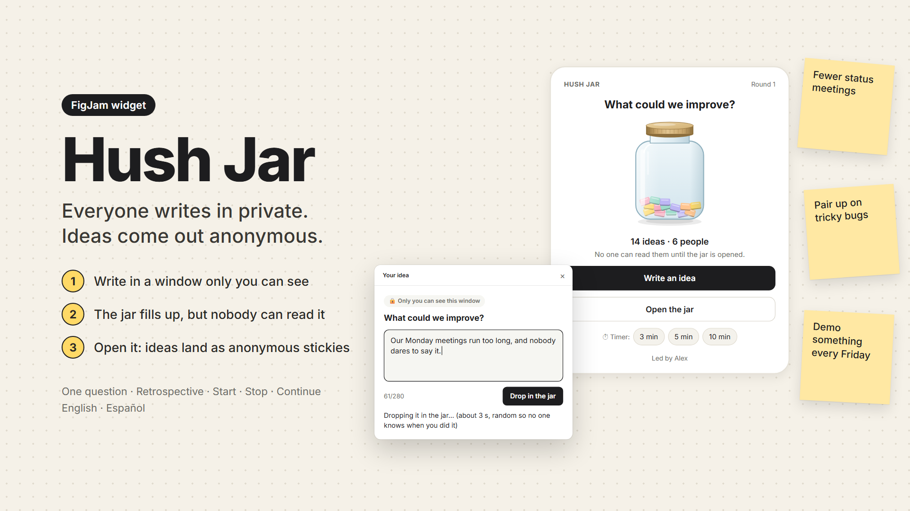
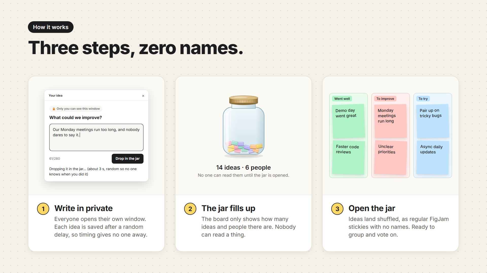

<p align="center">
  
</p>

<h1 align="center">Hush Jar</h1>

<p align="center">
  <b>Everyone writes in private. Ideas come out anonymous.</b><br>
  A FigJam widget for retros, brainstorms and the questions people answer more honestly when nobody knows who said what.
</p>

<p align="center">
  
  
  
  
  <a href="LICENSE"></a>
</p>

<p align="center"><b>English</b> · <a href="README.es.md">Español</a></p>

<p align="center">
  
</p>

## Why

Every FigJam sticky carries its author's name, and anyone can turn the label back on. On top of that, as soon as someone writes, everyone else can read it, so the first idea on the board sets the tone for the rest. Miro and Mural have a private mode for this. FigJam doesn't, and people have been asking for [private writing](https://forum.figma.com/suggest-a-feature-11/private-writing-13312) and [truly anonymous stickies](https://forum.figma.com/suggest-a-feature-11/bring-truly-anonymous-sticky-notes-to-figjam-8801) on the Figma forum since 2022.

The usual workaround is a Google Form or Slido, then pasting the answers onto the board. Hush Jar does it inside the board instead. Only the facilitator adds the widget; everyone else just clicks.

## How it works

<p align="center">
  
</p>

1. **Set up.** Pick a format, write the question and press **Start**. Whoever presses Start leads the session.
2. **Write.** Everyone clicks **Write an idea** and types in a window only they can see. You can edit or remove your own ideas until the jar is opened.
3. **Open.** The facilitator presses **Open the jar**. The ideas land next to it as regular FigJam stickies, shuffled and with no names, ready to group and vote on.

From the jar you can also start FigJam's timer (3, 5 or 10 minutes). If you pressed Start with the wrong format, **← Back** takes you to setup as long as nobody has written yet. **New round** asks the next question. If the facilitator has to leave, someone else can pick **Lead the session myself** from the widget's menu.

## Formats

| Format | Columns | Stickies |
| --- | --- | --- |
| One question | — | 🟨 Yellow |
| Retrospective | Went well · To improve · To try | 🟩 🟥 🟦 One section per column |
| Start · Stop · Continue | Start doing · Stop doing · Continue doing | 🟩 🟥 🟦 One section per column |

## How it keeps ideas anonymous

- Each idea is stored with a random key and its column. No name, no user ID, no time.
- An idea is saved 2 to 5 seconds after you click, at random, so the moment you hit the button doesn't give you away. Edits and removals wait too.
- The jar counts people with a random token kept on each person's computer, never with names.
- The slips inside the jar don't use their column's colour, so nobody can tell from a colour what someone wrote.
- If fewer than 3 people have written, the jar warns the facilitator before opening: with that few people it's easy to guess who wrote what.
- The facilitator's Figma creates the stickies, with the author label hidden. If someone turns the label back on, they see the facilitator's name, not the writer's.
- No network access. The manifest declares `"allowedDomains": ["none"]`, so nothing leaves Figma.

The full list of what gets stored, and where, is in the [data security answers](hush-jar/publicar/ficha.md#seguridad-de-datos) prepared for the Community listing.

## Install

Hush Jar has been submitted to the Figma Community and is waiting for review. Until then you can run it from source in Figma Desktop:

1. Clone this repository or download it as a ZIP.
2. In a FigJam file, open **Main menu → Widgets → Development → Import widget from manifest…** and pick `hush-jar/manifest.json`.
3. Insert it from **Widgets → Development → Hush Jar**. The first jar starts in English; switch to Spanish under **Language** in the widget's menu.

The built bundle (`hush-jar/dist/code.js`) is committed, so there's no build step to try it. A widget in development only works for the person who imported it, so a session with your team needs the Community version.

## Development

```bash
cd hush-jar
npm install
npm test          # type check, build, and simulated sessions with three people in both languages
npm run watch     # rebuilds dist/code.js on save
npm run imagenes  # regenerates the icon, the covers and the images in this README
```

`npm test` also writes two previews you can open in a browser: `scripts/preview-tarro.html` shows the jar in several states and `scripts/preview-ventana.html` shows the private window in both languages. `npm run imagenes` needs Node 24 and Microsoft Edge, which it runs headless to take the screenshots.

All the copy lives in [`hush-jar/widget-src/textos.ts`](hush-jar/widget-src/textos.ts). To add a language, copy one of the dictionaries and translate it. If a phrase is missing, the type check fails.

```
hush-jar/
  widget-src/   code.tsx (the widget), tarro.ts (the jar drawing), textos.ts (all the copy)
  ui.html       the private writing window
  dist/         the bundle Figma loads
  scripts/      smoke tests, previews and the image generator
  publicar/     Community listing: copy, icon and covers
spikes/         the test bench used to check the Widget API before building
propuesta-hush-jar.md   the original proposal and market research
```

The step-by-step testing and publishing guide is in [`hush-jar/README.md`](hush-jar/README.md). It's in Spanish, like the code comments and the proposal.

## Status

Version 0.4. Known gaps:

- Copies of a jar aren't protected yet, so a duplicate could be used to open ideas that aren't yours.
- The Community listing is in review. This README will link to it once it's live.

## License

[MIT](LICENSE) © 2026 Jorge Molina
